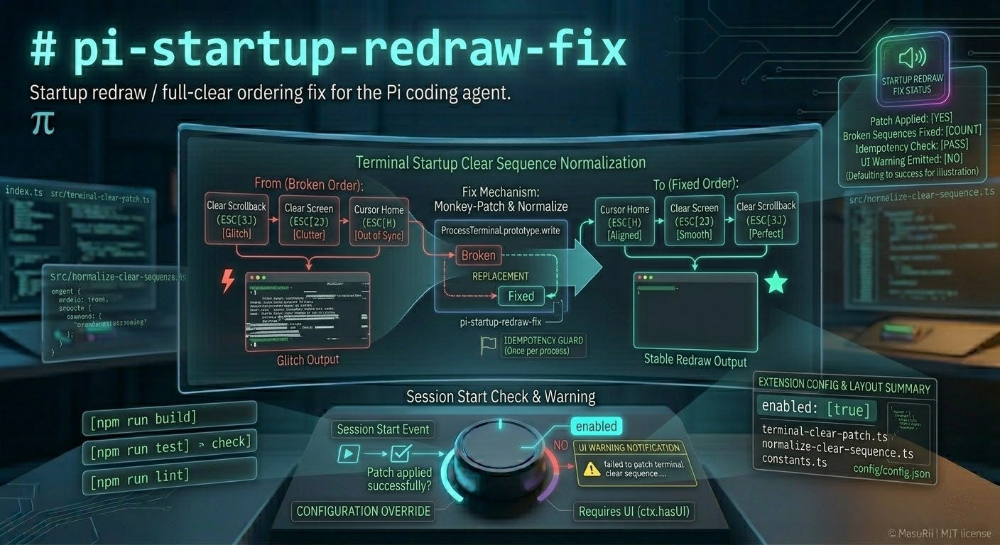

# pi-startup-redraw-fix

Startup redraw / full-clear ordering fix for the Pi coding agent.

This extension patches the terminal “full clear” escape sequence emitted during startup so the screen/scrollback clear happens in a stable order, avoiding redraw glitches in some terminal setups.



## Features

- Normalizes the startup full-clear escape sequence order:
  - **From:** `\x1b[3J\x1b[2J\x1b[H`
  - **To:** `\x1b[H\x1b[2J\x1b[3J`
- Applies the patch **once per Node process** by monkey-patching `ProcessTerminal.prototype.write`.
- On `session_start`, shows a **UI warning** (when UI is available) if patching failed.

## Installation

### Local extension folder

Place this folder in one of Pi’s auto-discovered extension locations:

- Global: `~/.pi/agent/extensions/pi-startup-redraw-fix`
- Project: `.pi/extensions/pi-startup-redraw-fix`

If you keep it elsewhere, add the path to your Pi settings `extensions` array.

### As an npm package

```bash
pi install npm:pi-startup-redraw-fix
```

Or from git:

```bash
pi install git:github.com/MasuRii/pi-startup-redraw-fix
```

(For development or non-Pi environments, `npm i pi-startup-redraw-fix` also works.)

## Usage

This extension has **no commands**.

When the extension is loaded, it immediately attempts to patch `ProcessTerminal.prototype.write`. On each new session (`session_start`), if Pi has a UI and the patch did not apply, it emits a warning notification.

## Configuration

### Enable / disable

Runtime config is stored alongside the extension at:

- `~/.pi/agent/extensions/pi-startup-redraw-fix/config.json`

A starter template is included at:

- `config/config.example.json`

Minimal config:

```json
{
  "enabled": true
}
```

Notes:

- In environments where Pi honors an extension-local `enabled` flag, set `"enabled": false` to disable the extension.
- If your Pi build does not use `enabled` for extension loading, disable by removing the extension from your Pi settings `extensions` list (or by uninstalling it).

## How it works (high level)

Pi’s TUI uses `@mariozechner/pi-tui`’s `ProcessTerminal` to write escape sequences to the terminal.

This extension:

1. Wraps `ProcessTerminal.prototype.write`.
2. For each write, replaces any occurrence of the exact “broken” full-clear sequence:
   - `ESC [ 3 J` (clear scrollback)
   - `ESC [ 2 J` (clear screen)
   - `ESC [ H` (cursor home)
3. With the “fixed” order:
   - `ESC [ H` (cursor home)
   - `ESC [ 2 J` (clear screen)
   - `ESC [ 3 J` (clear scrollback)

The patch is guarded by an internal flag so it is **idempotent** (loading the extension multiple times will not stack-wrap `write`).

## Limitations / compatibility

- Only affects data written via `ProcessTerminal.prototype.write`.
- Only rewrites the **exact** byte sequence `\x1b[3J\x1b[2J\x1b[H`.
  - If your terminal redraw issue is caused by different escape sequences, this extension will not help.
- If `ProcessTerminal.write` is not available (or the underlying API changes), the patch will fail and you’ll see a warning on `session_start` (when UI is available).

## Troubleshooting

### I see a warning: “failed to patch terminal clear sequence …”

This warning is shown on `session_start` when:

- Pi has a UI (`ctx.hasUI`), and
- the extension could not patch `ProcessTerminal.prototype.write`.

Common causes:

- Incompatible Pi / `@mariozechner/pi-tui` version where `ProcessTerminal.write` is missing or changed.
- Another extension or runtime modified the terminal layer in an unexpected way.

What to try:

1. Update Pi and your extensions.
2. Temporarily disable other terminal/TUI-related extensions to identify conflicts.
3. Verify the extension is actually being loaded (installed to an auto-discovery folder or referenced in your Pi settings).

## Development

```bash
npm run build
npm run lint
npm run test
npm run check
```

## Project layout

- `index.ts` — root entrypoint (kept for Pi auto-discovery / package export)
- `src/index.ts` — extension bootstrap + `session_start` warning notification
- `src/terminal-clear-patch.ts` — `ProcessTerminal.prototype.write` monkey-patch + idempotency guard
- `src/normalize-clear-sequence.ts` — string rewrite helper
- `src/constants.ts` — escape sequence constants
- `config/config.example.json` — starter config template

## License

MIT
